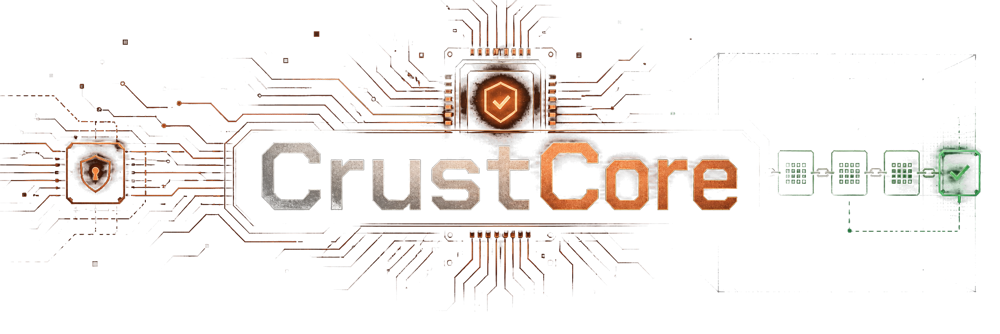

<div align="center">



# CrustCore

### The verifier kernel for autonomous coding agents.

**A sub-800 kB Rust core that owns completion, integration, secrets, and approvals — so a patch ships because your verify command passed in a clean sandbox, not because a model said it was done.**

[](https://github.com/RNT56/CrustCore/actions/workflows/ci.yml)
&nbsp;
&nbsp;
&nbsp;
&nbsp;
&nbsp;
&nbsp;
&nbsp;

<em>Models may propose. Subagents may explore. External workers may produce patches. Tools may execute.<br/>
Only CrustCore may <strong>authorize, verify, persist, expose, or integrate.</strong></em>

</div>

---

## The problem

Most coding-agent frameworks are large, trusted blobs. They hold your
credentials, run shell commands, push branches, and open PRs — and the moment of
truth, *"is this change actually done?"*, comes down to a model emitting the word
**done**. You audit that by reading a transcript and hoping.

CrustCore refuses that bargain. It is built on one inversion:

> **A model's claim is evidence, never authority.**
> Completion, integration, secrets, and approvals are decided by a small, typed,
> auditable kernel — and *proven*, not asserted.

You do not have to trust CrustCore's agent. You can **read the kernel, prove what
is allowed, and replay exactly what happened.**

---

## What that buys you

<table>
<tr>
<td width="50%" valign="top">

**Verifier-owned completion**

A patch is `done` only after CrustCore re-runs *your* verify command in a clean
sandbox and mints a `VerifiedPatch`. That type is **sealed** — the only thing
that can construct one is the verifier, and `complete_task` consumes it by value.
A model cannot fabricate completion; the type system will not let it.

</td>
<td width="50%" valign="top">

**Dangerous states are unrepresentable**

Not "discouraged" — *uncompilable*. A secret cannot be `Debug`/`Serialize`/`Clone`d
or turned into model-visible text. A path that escapes the worktree has no type.
An irreversible action with no `Approved<_>` token does not type-check. The
compiler is the first line of the security policy.

</td>
</tr>
<tr>
<td width="50%" valign="top">

**Replayable, tamper-evident audit**

Every run is an **append-only, hash-chained event log** plus per-tool
**receipts** (a keyed MAC chain a model cannot forge). `crustcore inspect` walks
the chain and tells you the first byte that was altered. Your audit story is a
proof, not a vibe.

</td>
<td width="50%" valign="top">

**Tiny by architecture, not by flag**

The trusted binary is **478.7 KiB stripped** (Linux x86_64) and *refuses* to link Tokio, TLS, a
database, an MCP SDK, or any provider SDK — a CI size gate keeps it that way.
Small enough to read end to end in an afternoon. Even with **every capability pack linked**
(`crustcore --features full`) the binary is just **576.7 KiB** — still under the 600 KiB
stretch goal — because the heavy live stacks run in spawned sidecars, never linked in.

</td>
</tr>
<tr>
<td width="50%" valign="top">

**Sandboxed or not at all**

Shell, tests, and external workers run under an explicit sandbox profile —
bounded output, timeouts, process-tree kill, a from-scratch environment with no
inherited secrets, deny-all egress. If no sandbox backend is present, execution
is **refused**. There is no "just run it unsandboxed" path.

</td>
<td width="50%" valign="top">

**Pay only for what you use**

`nano → net → daemon → mcp → index → full`. Network, providers, Telegram, GitHub,
MCP, and code intelligence are separate capability packs. Unused capabilities
cost **zero model context** and, by feature-gating, **zero linked code**.

</td>
</tr>
</table>

---

## How a task actually completes

```text
goal ─▶ model proposes a patch        (a BackendResult — a claim, nothing more)
         │
         ▼
      disposable git worktree         (isolated · path-confined · throwaway)
         │
         ▼
      YOUR verify command, re-run      (in the sandbox: bounded · timed · deny-all egress)
         │
   ┌─────┴─────┐
 exit 0      exit ≠ 0
   │             │
   ▼             ▼
VerifiedPatch   rejected — no completion, no PR, no merge
   │            (the model's "done" is logged as advisory metadata, never honored)
   ▼
complete / integrate / open a draft PR   (irreversible steps still need an approval token)
```

Completion flows from **verifier evidence**, never from the model. The same
`VerifiedPatch`-by-value gate guards `complete_task`, branch integration, and PR
creation — there is no other door.

---

## Architecture in one screen

A **nanokernel plus capability packs**. The kernel is a synchronous,
deterministic, allocation-light reducer — `event → state → bounded actions` —
with **no async runtime, no network, no database, and no wall clock**. The dirty
outside world only ever reaches it as translated events.

```text
                      ┌─────────────────────────────────────────────┐
   raw HTTP · TLS     │               crustcore-kernel              │
   Telegram · GitHub  │    sync · deterministic · std-only · tiny   │
   MCP · shell · SQL  │                                             │
        │             │    task/job state machine · typed budgets   │
        │  adapters   │    capability + approval tokens · policy    │
        ▼  translate  │    event/receipt framing · backend contract │
   ┌──────────┐ events └──────────────────┬──────────────────────────┘
   │ sidecars │ ──────────────▶           │  bounded Action list
   └──────────┘                           ▼
   net · daemon · mcp · index      git worktree · sandbox · verifier
        (capability packs)         disposable · confined · evidence-only
```

Adapters do all the translation, so the trust boundary stays small and legible:

```text
Telegram update  →  InboundEnvelope        →  Event::UserTurn
GitHub webhook   →  GitHubEnvelope         →  Event::GitHubObserved
Model response   →  AgentObservation       →  Event::ModelOutput
Tool result      →  ToolReceipt + Artifact →  Event::ToolCompleted
```

Full design: **[docs/architecture.md](./docs/architecture.md)** &nbsp;·&nbsp; size discipline:
**[docs/nano-size-budget.md](./docs/nano-size-budget.md)** &nbsp;·&nbsp; product stack:
**[docs/product-stack.md](./docs/product-stack.md)** &nbsp;·&nbsp; product roadmap:
**[docs/world-class-agent-roadmap.md](./docs/world-class-agent-roadmap.md)**

---

## What's inside

| | |
| --- | --- |
| **Footprint** | the trusted binary is **478.7 KiB** stripped (Linux x86_64) — std-only, with no async runtime, network, or database linked in |
| **Trusted core** | the kernel · a hash-chained event log + tool receipts · symlink-safe path confinement · a sandboxed command runner · the worktree verify loop · the type-sealed `VerifiedPatch` |
| **Model & secrets** | a unified multi-modal provider registry — completion, embedding, and rerank — reached through a *spawned* helper · a secret broker with an encrypted vault and a redaction / taint boundary |
| **Integrations** | a Telegram control channel · GitHub REST + hardened webhooks · an MCP gateway / client / server · subagent supervision & execution · a second-opinion advisor · repo & semantic memory |
| **Compose & build** | a typed workflow graph · a session / artifact service · the `#[crust_tool]` authoring macro · RAG + vector-store adapters · OpenTelemetry / GenAI export · a loopback developer UI |
| **Verified quality** | **~1,120 tests** — property tests, no-panic fuzzes, tamper tests, goldens — plus red-team fixtures for prompt-injection, path-escape, fake tool results, secret-leak, hidden-MCP-instructions, memory-as-authority, and forged / replayed webhooks |

---

## Product tiers

| Tier | Size (Linux x86_64) | Purpose |
| --- | --- | --- |
| **`crustcore` / `crustcore-nano`** | **478.7 KiB** | the trusted local verifier harness — the flagship |
| **`crustcore --features full`** | **576.7 KiB** | *every* capability pack (net + daemon + mcp + index + chat) linked into **one** binary — only +98 KiB over nano, **still under the 600 KiB stretch goal**, because the heavy stacks stay in sidecars |
| `crustcore-net` | 3–8 MB | network + provider sidecar (Tokio/TLS/providers) — a *spawned* helper, never linked into nano |
| `crustcore-daemon` | 4–10 MB | long-running runtime: Telegram/GitHub loops, supervision |
| `crustcore-mcp` | 3–10 MB | MCP gateway/client/server + code-mode |
| `crustcore-index` | 2–8 MB | repo memory / code intelligence |
| `crustcore-full` (`--features all`) | 8–25 MB+ | the convenience crate that *also* links every **live** stack (Tokio/TLS/DBs/tree-sitter) — never the size-claim binary |

Both flagship figures are measured by the CI size gate (`cargo xtask size-check` / `cargo xtask
full-size`); `crustcore --features full` links every capability pack's **decision core** but
none of the heavy live I/O — that runs in the spawned sidecars above. (macOS: nano 412.0 KiB,
full 493.1 KiB.)

Higher-level packs build on these — each non-nano and feature-gated, so they
never touch the flagship binary: `crustcore-flow` (typed workflow graph),
`crustcore-session` (sessions & artifacts), `crustcore-toolkit` +
`crustcore-tool-macro` (the `#[crust_tool]` authoring macro), `crustcore-index-rag`
(RAG & vector stores), `crustcore-telemetry` (OpenTelemetry / GenAI export), and
`crustcore-dev` (a loopback developer / inspector UI).

---

## Quickstart

```bash
# 1. The full "is it done?" gate — fmt + clippy -D warnings + tests
#    + forbidden-dependency check + the nano size gate.
cargo xtask verify

# 2. Build the flagship and print its size.
cargo xtask size-check          # crustcore-nano: 478.7 KiB (Linux x86_64)

# 3. Is this host ready to run verified tasks?
cargo run -p crustcore --no-default-features --features nano -- doctor

# 4. Run a task: create a disposable worktree, re-run <cmd> in a sandbox,
#    and complete ONLY if it passes.
crustcore run -dir . -goal "fix the failing test" -verify "cargo test"

# 5. Audit it: verify the hash chain and replay the run.
crustcore inspect ./events.log      # → INTACT, with a task summary
crustcore export  ./events.log      # → JSONL

# 6. Cut a checksummed release artifact.
cargo xtask release                 # → SHA256SUMS + release-manifest.txt
```

Runs on **Linux and macOS** — sandboxed execution uses `bubblewrap` on Linux and
`sandbox-exec` (Seatbelt) on macOS, with the same deny-all-egress, writes-confined-to-
the-worktree posture; the nano build is reproducible on both. The workspace is
**std-only and builds offline**; heavy dependencies live only in the sidecar packs.
Requires a stable Rust toolchain (≥ 1.85) with `rustfmt` and `clippy`, pinned in
[`rust-toolchain.toml`](./rust-toolchain.toml). Release & operations:
**[docs/releasing.md](./docs/releasing.md)**.

### Just want it running? One binary.

The trusted core is multi-binary by design (a tiny `crustcore` that *spawns* a model
helper). For casual use there's a convenience all-in-one — **one binary** that bundles the
chat front door, the Telegram bot, and the model helper, and spawns *itself* as that helper
(nothing to put on PATH):

```bash
cargo build --release -p crustcore-full --features all   # the heavy convenience tier

crustcore-full setup     # write a config file (model keys + optional bot token)
crustcore-full chat      # a terminal coding agent — type, get answers, ask it to fix code
crustcore-full serve --pair   # or: run a Telegram bot (then --chat-id <id> --dir . --verify '<cmd>')
```

With no model provider configured it answers from a deterministic **mock** (offline);
set `CRUSTCORE_NET_PROVIDERS` (in the config file) to a provider config to go live. The
trusted boundary is unchanged — this binary only *wires* the same redacted, sandboxed,
verifier-owned components together.

---

## The 20 invariants

These are **release blockers**, not aspirations — each is enforced in types,
tests, or both, and catalogued in **[INVARIANTS.md](./INVARIANTS.md)**.

<details>
<summary><strong>Show all 20</strong></summary>

```text
 1. The LLM never receives raw credentials.
 2. The LLM never receives unredacted secret-bearing logs.
 3. Secret material is not Debug, Serialize, Clone, or model-visible.
 4. The model cannot approve its own side effects.
 5. Subagents cannot directly message the user.
 6. External workers are patch producers, not truth authorities.
 7. Repo files, comments, web pages, MCP output, and shell output are untrusted data.
 8. Every side effect passes through policy.
 9. Every execution-capable operation runs in an explicit sandbox profile.
10. Every model-visible tool result has a receipt.
11. Every task has budget limits.
12. Every long-running job has lease, heartbeat, cancellation, and recovery.
13. Every shippable patch is a VerifiedPatch.
14. Irreversible actions require an approval token.
15. Runtime user communication goes through authorized, redacted channels (Telegram by default; the sanctioned `crustcore chat` front door).
16. The CLI is setup/admin/emergency; the only sanctioned conversational surface is the explicit, redacted `crustcore chat` front door.
17. Model/provider names are config and capability-probed, not permanent assumptions.
18. Self-improvement happens through PRs/evals, not live mutation of the running kernel.
19. The nano build must remain below the configured size budget.
20. Unused capabilities cost zero model context and preferably zero linked code.
```

</details>

---

## Documentation

| If you are… | Read |
| --- | --- |
| Building on or contributing to CrustCore | **[CLAUDE.md](./CLAUDE.md)** — the single source of truth · [CONTRIBUTING.md](./CONTRIBUTING.md) |
| Reviewing security posture | [SECURITY.md](./SECURITY.md) · [THREAT_MODEL.md](./THREAT_MODEL.md) · [docs/security-model.md](./docs/security-model.md) |
| Wanting the rules that can never break | [INVARIANTS.md](./INVARIANTS.md) |
| Going deep on a subsystem | [`docs/`](./docs) — [architecture](./docs/architecture.md) · [sandbox](./docs/sandbox.md) · [secrets](./docs/secrets.md) · [policy](./docs/policy.md) · [event log](./docs/event-log.md) · [receipts](./docs/receipts.md) · [releasing](./docs/releasing.md) |

---

## License

Licensed under the [Apache License, Version 2.0](./LICENSE) — see [`NOTICE`](./NOTICE).
Unless you state otherwise, any contribution you intentionally submit for
inclusion shall be licensed as above, without additional terms
(see [CONTRIBUTING.md](./CONTRIBUTING.md)).

---

<div align="center">
<em>Keep the core small, typed, and provable. Push everything heavy to the edges.</em>
</div>
